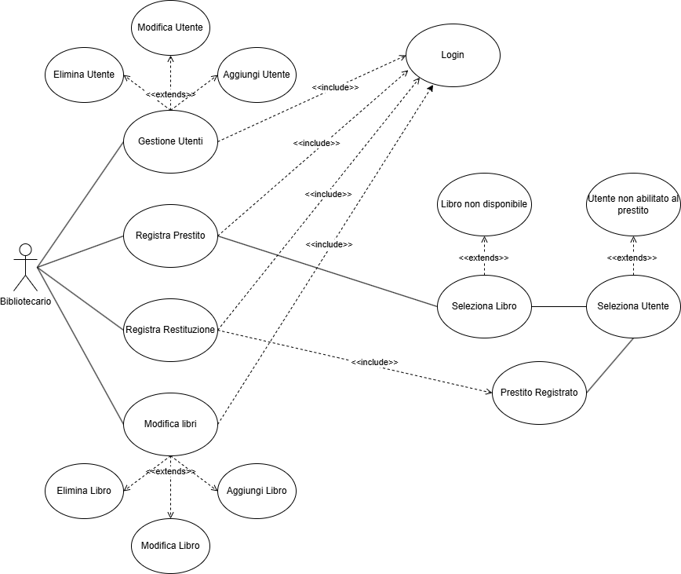

# ANALISI DELLE SPECIFICHE

- Obiettivo  
Il cliente richiede un'applicazione per gestire il catalogo, gli utenti e i prestiti di una biblioteca, in modo da rendere facili accessibili e veloci le operazioni di ricerca, pretito e restituzione dei libri. 

**1. Tabella dei Requisiti**
    
| Area dei Requisiti | ID univoco |
|----------|----------|
| Funzionalità individuali (**IF**)   | [IF-1.1](#accesso) , [IF-1.2](#utenti) , [IF-1.3](#utenti) , [IF-1.4](#libri) , [IF-1.5](#libri) |
| Business Flow (**BF**)   | [BF-1.1](#prestiti) , [BF-1.2](#prestiti) , [BF-1.3](#prestiti) , [BF-1.4](#prestiti)   |
| Data Format (**DF**)|[DF-1.1](#accesso) , [DF-1.2](#utenti) , [DF-1.3](#libri) , [DF-1.4](#archivio) |
| Interfaccia Utente (**UI**)|[UI-1.1](#utenti) , [UI-1.2](#libri) , [UI-1.3](#prestiti)|
| Ulteriori Vincoli (**FC**)|[FC-1.1](#altri) , [FC-1.2](#altri) , [FC-1.3](#altri) , [FC-1.4](#altri) , [FC-1.5](#altri) |

***
**2. Requisiti Funzionali**  
  - <a name="accesso">***Accesso***</a>        
DF-1.1 : I bibliotecari possono accedere al sistema attraverso usernsame e password    
IF-1.1 : Il sistema deve assicurare un metodo per recuperare o reimpostare le credenziali di accesso
  - <a name="utenti">***Utenti***</a>	             
      IF-1.2 : Un utente può essere registrato, modificato o cancellato dal bibliotecario  
      DF-1.2 : ogni utente avrà Nome, Cognome, Matricola, mail istituzionale, lista dei prstiti attivi	    
      UI-1.1 : Il bibliotecario può visualizzare la lista di tutti gli utenti ordinata per cognome e nome	    
      IF-1.3 : Gli utenti possono essere ricercati per cognome o matricola	
  - <a name="libri">***Libri***</a>        
  IF-1.4 : Un libro può essere aggiunto o rimosso        
      DF-1.3 : ogni Libro dovrà essere registrato attravero Titolo, Autori, Anno di pubblicazione, Codice ISBN, numero di copie	    
      UI-1.2 : Il bibliotecario può visualizzare la lista di tutti i libri ordinati per titolo	    
      IF-1.5 : I libri possono essere cercati per titolo, autore o codice ISBN	
  - <a name="prestiti">***Gestione prestiti***</a>        
        BF-1.1 : Il bibliotecario può registrare un prestito selezionando un libro e un utente e specificando la data della restituzione	    
      BF-1.2 : Un libro può essere prestato solo se ci sono copie disponibili	    
      BF-1.3 : Un utente non può avere più di tre libri in prestito contemporaneamente	    
      UI-1.3 : Il bilbiotecario può visualizzare l'elenco dei prestiti attivi, ordinato per prevista data di restituzione (evidenziando i ritardi)	    
      BF-1.4 : Il bibliotecario può registrare la restituzione di un libro
- <a name="archivio">***Archivio***</a>        
      DF-1.4 : Tutto il Database deve poter essere salvato su file 
***

**3. <a name="altri">Requisiti non funzionali</a>**	
 -  FC-1.1 : Sicurezza, deve essere garantito l'accesso ai soli bibliotecari

 -  FC-1.2 : Performance, bisogna garantire l'aggiornamento in tempo reale del catalogo e della disponibilità dei libri, e la ricerca deve rimanere nel giro dei pochi secondi

 -  FC-1.3 : Usabilità, deve avere un interfaccia grafica facile da capire e utilizzare

 -  FC-1.4 : Compatibilità, deve garantire utilizzo su vari sistemi operativi

 -  FC-1.5 : Scalabilità, il sistema deve essere in grado di essere modificato per gestire un ipotetico volume maggiore di libri, utenti e prestiti
***

**4. Casi D'uso**

**1)**  
-Nome: ***Registrazione Utente***    
 -Attori partecipanti: Bibliotecario   
 -Precondizioni: Bibliotecario loggato  
 -Post condizioni: il bibliotecario ha registrato un utente    
 **Flusso eventi:**  
   1. Bibliotecario va nell'area "gestione utente"    
   2. Bibliotecario sceglie l'opzione di creare un nuovo utente  
   3. Bibliotecario inserisce nome, cognome, matricola, mail, lista dei prestiti attivi      
   4. Account creato e salvato nel DB della biblioteca  

**2)**  
-Nome: ***Modifica Utente***  
  -Attori partecipanti: bibliotecario  
  -Precondizioni:bibliotecario loggato e utente registrato    
  -Postcondizioni:utente modificato   
  **Flusso eventi:**  
   1. Il bibliotecario va nell'area "gestione utente"  
   2. Il bibliotecario cerca l'utente da modificare    
   3. Il bibliotecario seleziona l'utente
   4. Il bibliotecario modifica i dati dell'utente  
   5.  Account modificato e DB aggiornato

**3)**  
-Nome: ***Eliminazione Utente***  
 -Attori partecipanti:bibliotecario  
 -Precondizioni: bibliotecario loggato e utente registrato  
 -Postcondizioni: utente eliminato      
 **Flusso eventi:**  
  1. Il bibliotecario va nell'area "gestione utente"  
  2. Il bibliotecario cerca l'utente da eliminare  
  3. Il bibliotecario seleziona l'utente da eliminare  
  4. Viene controllato se l'utente abbia prestiti in sospeso  
  5. Il bibliotecario elimina l'utente dall'archivio   
  **Flusso alternativo:**  
  4a. L'utente ha ancora prestiti attivi  
  4a. Non può essere cancellato un utente se non ha risolto tutti i suoi prestiti
  
**4)**
-Nome: ***Registrazione Prestito***  
 -Attori partecipanti:Bibliotecario    
 -Precondizioni:bibliotecario loggato e utente registrato  
 -Postcondizioni: l'utente ha ricevuto il libro in prestito  
 **Flusso eventi:**    
   1. Il bibliotecario controlla se il libro che è stato richiesto dall'utente è presente in biblioteca  
   2. Il bibliotecario controlla se l'utente ha più di tre libri già in prestito  
   3. Il bibliotecario specifica la data entro il quale deve essere restituito  
   4. Il libro viene marcato come in prestito e il catalogo viene aggiornato    
 **Flusso alternativo:**  
   1a. Il libro non è presente  
   2a. L'utente ha più di 3 libri in prestito   
   
 
**5)**  
-Nome: ***Registrazione Restituzione***  
  -Attori partecipanti:Bibliotecario   
  -Precondizioni: bibliotecario loggato utente registrato  
  -Postcondizioni: l'utente ha restituito il libro in prestito    
  **Flusso eventi:**  
   1. Bibliotecrio controlla se il prestito è nell'elenco  
   2. Viene confermata la restituzione e aggiornato il database    
   **Flusso alternativo:**  
   1a. Prestito non esistente

**6)**
-Nome: ***Aggiunta Libro***  
-Attori partecipanti:bibliotecario  
 -Precondizioni: bibliotecario loggato    
 -Postcondizioni: libro registrato      
 **Flusso eventi:**  
  1. Il bibliotecario riceve un libro non presente nel catalogo  
  2. Il bibliotecario va nell'area "Gestione Libri"  
  3. Il Bibliotecario sceglie "Aggiungi Libro"  
  4. Il bibliotecario registra il libro con: il titolo, l'autore, l'anno di pubblicazione e il codice isbn del libro  
  5. Il catalogo viene aggiornato  
  

**7)**  
-Nome: ***Modifica Libro***  
  -Attori partecipanti: bibliotecario  
  -Precondizioni:bibliotecario loggato e libro già presente in catalogo  
  -Postcondizioni:libro modificato   
  **Flusso eventi:**  
   1. Il bibliotecario deve modificare i dati di un libro
   2. Il bibliotecario va nell'area "Gestione Libri"   
   3. Il bibliotecario cerca il libro da modificare  
   4. Il bibliotecario seleziona il libro  
   5. Il bibliotecario modifica i dati del libro  
   6. Le modifiche vengono salvate

**8)**  
-Nome: ***Eliminazione Libro***  
 -Attori partecipanti:bibliotecario  
 -Precondizioni: bibliotecario loggato  
 -Postcondizioni: libro eliminato      
 **Flusso eventi:**  
  1. Il bibliotecario deve eliminare un libro dall'archivio  
  2. Il bibliotecario va nell'area "Gestione Libri"  
  3. Il bibliotecario cerca il libro da eliminare  
  4. Il bibliotecario seleziona il libro da eliminare  
  5. Il bibliotecario controlla se ci sono copie del libro in prestito  
  6. Il bibliotecario elimina il libro dall'archivio    
**Flussi alternativi:**  
  5a. Il libro è attualmente in prestito  
  5a. Il bibliotecario non può eliminare il libro fin quando tutti le copie in prestito non sono ritornate  

  

   QA(esterni)

 Disponibilità: il sistema deve essere disponibile e operativo in qualsiasi momento in cui la biblioteca è aperta  
 
 Efficienza: il sistema deve essere sufficientemente efficiente da poter garantire tempi di attesa bassi per le operazioni relative ai libri e agli utenti  

 Sicurezza: il sistema necessità di un sistema di sicurezza basico caratterizzato da credenziali (password) utili per permettere unicamente agli addetti di potervi accedere  

 Scalabilità: il sistema deve permettere migliorie in caso il numero di utenti o di libri vada ad aumentare  

 Usabilità: il sistema deve essere intuitivo così da permettere a chi lo utilizza di lavorare alla massima efficienza

 QA(interni)  

 Manutentibilità: il sistema deve essere correttamente commentato e descritto così da essere modificato con facilità  

 Modularità: ...  

 Testabilità: ...  

 
   
 

    
    

